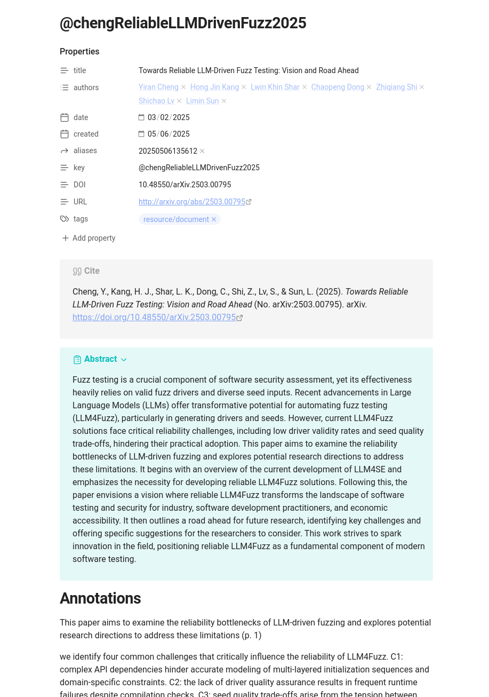
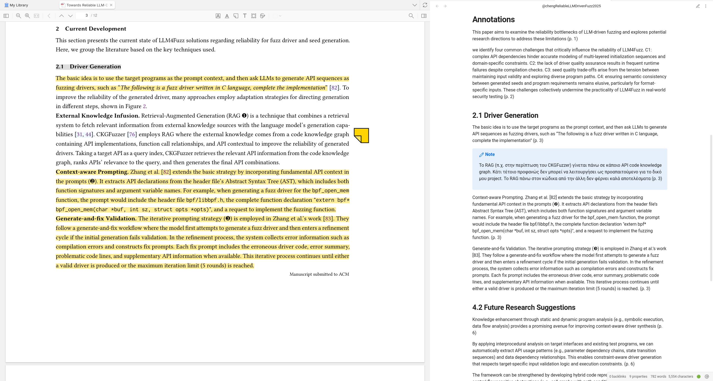

A template for creating notes in Obsidian from Zotero documents, using the
[Obsidian-Zotero-Integration](https://github.com/mgmeyers/obsidian-zotero-integration/)
plugin.

## Features

- Automatic "authors" links.
- Persisting "notes" section.
- Mirroring of document's headers.

    For this, the headers must be highlighted "Gray" in Zotero.
- Support for highlights, notes and image annotations.
- Only imports highlights in "Yellow", for more granularity on what is imported.

## Showcase

